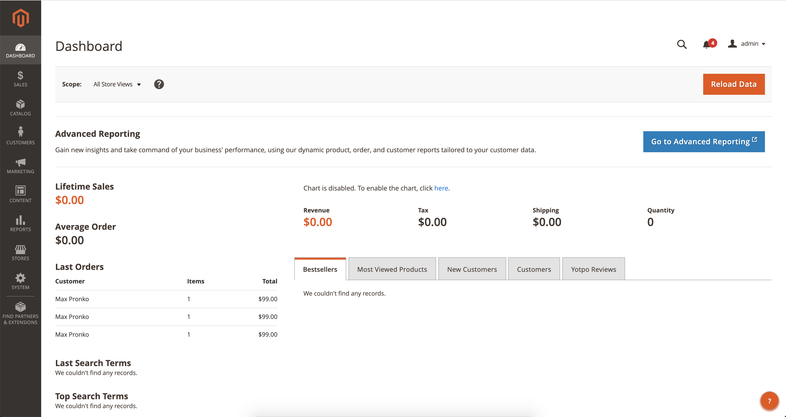
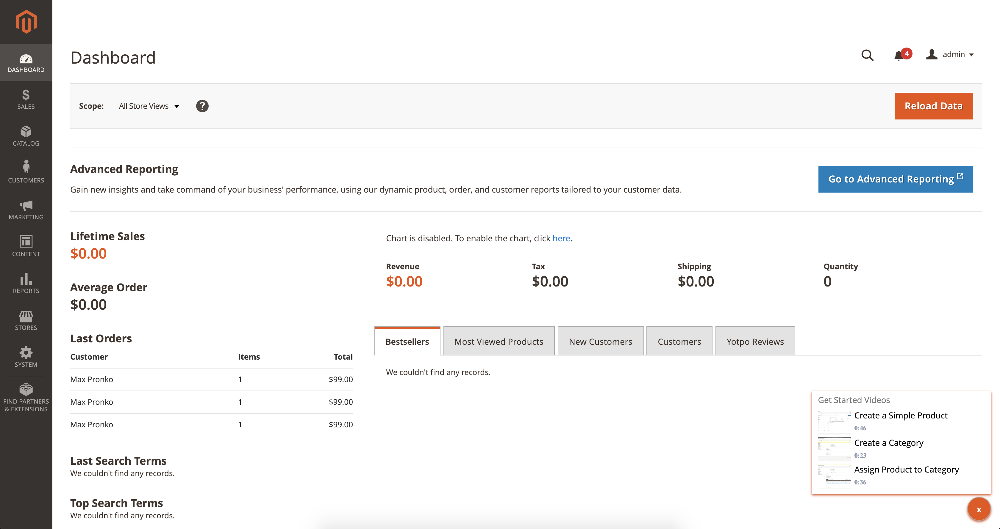
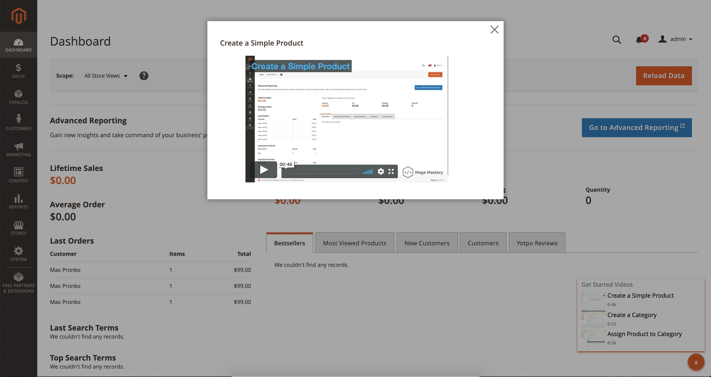

# Get started videos extension for Magento 2

The extension allows studying Magento 2 functionality directly from admin.

## Installation

Use official Magento 2 installation recommendations for installing this extension.

### System Requirements

The extension support the following Magento 2 versions:

* Magento Open Source/Commerce 2.3
* Magento Open Source/Commerce 2.4

## Unlock full potential of Magento 2 admin

Upon clicking the "?" icon, the modal popup with get started videos will appear.

Select a topic and watch the video tutorial.

## Author

* Max Pronko